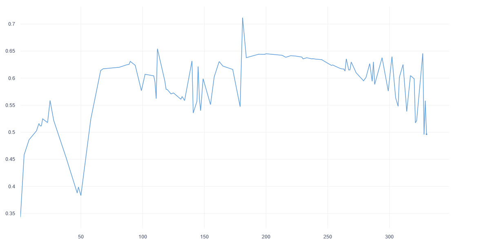
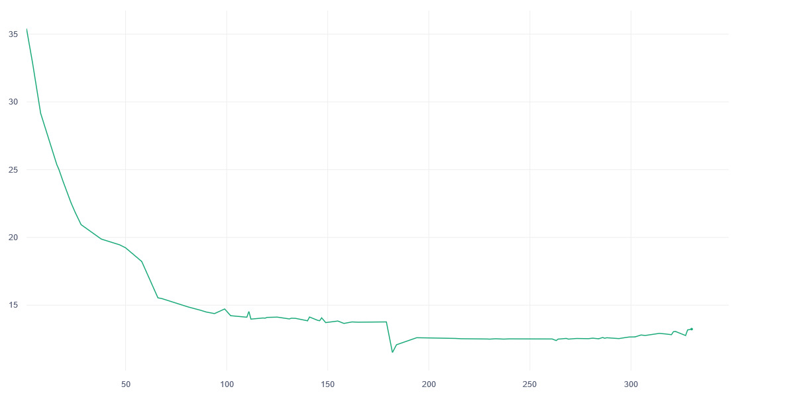
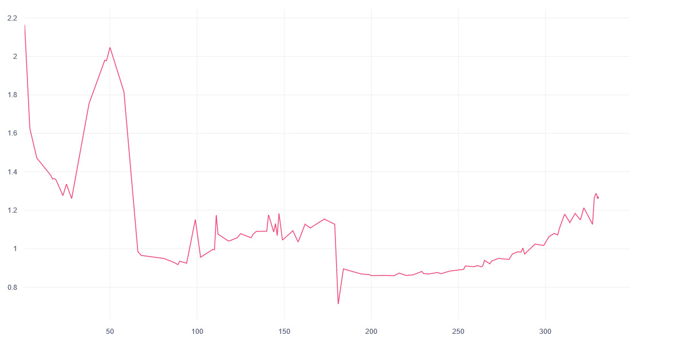
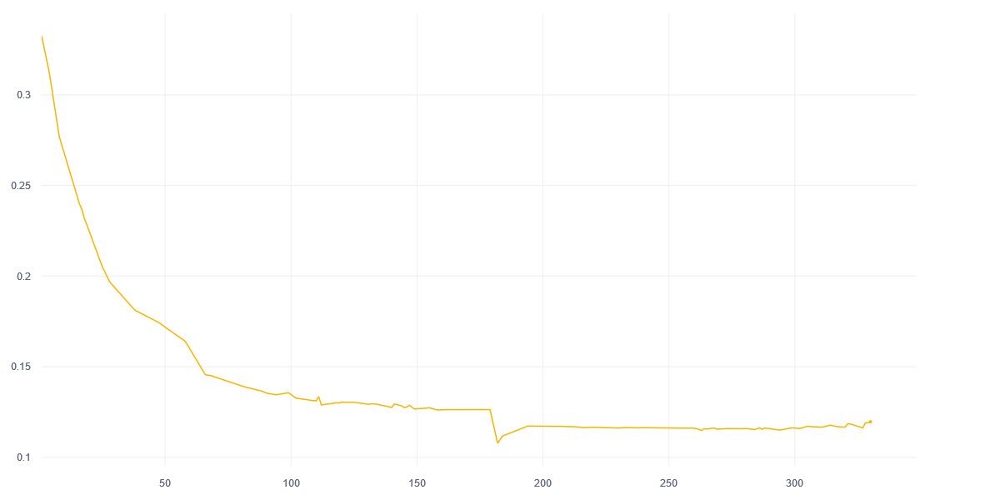

# SAR2Optical

## Overview

This is a Pix2Pix CGAN implementation for translating Synthetic Aperture Radar (SAR) images to optical images.

The demo: [yuulind/sar2rgb](https://huggingface.co/spaces/yuulind/sar2rgb)


## Table of Contents

- [Dataset](#dataset)
- [Results & Model Files](#results--model-files)
- [Loss](#loss-graphs)
- [Installation](#installation)
- [Usage](#usage)
- [Models](#training)
- [License](#license)
- [Acknowledgments](#acknowledgments)


## Dataset

For this project, paired SAR and optical (RGB) images from the Sentinel‑1 and Sentinel‑2 satellites are used to train the models. The dataset source is [Sentinel-1&2 Image Pairs, Michael Schmitt, Technical University of Munich (TUM)](https://mediatum.ub.tum.de/1436631).  The dataset is available on [Kaggle](https://www.kaggle.com/) at [Sentinel-1&2 Image Pairs (SAR & Optical)](https://www.kaggle.com/datasets/requiemonk/sentinel12-image-pairs-segregated-by-terrain), uploaded and curated by [Paritosh Tiwari (@requiemonk)](https://www.kaggle.com/requiemonk).

The dataset is divided into three splits: training, validation, and testing. We randomly sampled 1,600 image pairs for validation, and another 1,600 pairs were allocated for test. The remaining 12,800 image pairs were used for training. All splits have similar category distributions. The IDs for each split can be found in the [split.json](/data/split.json).

## Results & Model Files

- **BASELINE FID SCORE** is between **30 and 40**
- Baseline score is calculated by randomly sampling two sets from real images and comparing the them.
- Trained model files are uploaded to huggingface hub and kaggle.

| Number | Name                    | Model Type    | Description                                                                       | Link to Model File                                                                                       |
|--------|-------------------------|---------------|-----------------------------------------------------------------------------------|----------------------------------------------------------------------------------------------------------|
| 1      | pix2pix_gen_180.pth     | Generator     | Pix2Pix generator with transpose convolution, 180 epochs. **FID score is 185.04** | [pix2pix_gen_180.pth](https://huggingface.co/yuulind/pix2pix-sar2rgb/resolve/main/pix2pix_gen_180.pth)   |
| 2      | pix2pix_gen_265.pth     | Generator     | Pix2Pix generator with transpose convolution, 265 epochs. **FID score is 189.81** | [pix2pix_gen_265.pth](https://huggingface.co/yuulind/pix2pix-sar2rgb/resolve/main/pix2pix_gen_265.pth)   |
| 3      | pix2pix_gen_295.pth     | Generator     | Pix2Pix generator with transpose convolution, 295 epochs. **FID score is 187.73** | [pix2pix_gen_295.pth](https://huggingface.co/yuulind/pix2pix-sar2rgb/resolve/main/pix2pix_gen_295.pth)   |
| 4      | pix2pix_disc_180.pth    | Discriminator | Pix2Pix discriminator from epoch 180, with transpose convolution generator.       | [pix2pix_disc_180.pth](https://huggingface.co/yuulind/pix2pix-sar2rgb/resolve/main/pix2pix_disc_180.pth) |
| 5      | pix2pix_disc_265.pth    | Discriminator | Pix2Pix discriminator from epoch 265, with transpose convolution generator.       | [pix2pix_disc_265.pth](https://huggingface.co/yuulind/pix2pix-sar2rgb/resolve/main/pix2pix_disc_265.pth) |
| 6      | pix2pix_disc_295.pth    | Discriminator | Pix2Pix discriminator from epoch 295, with transpose convolution generator.       | [pix2pix_disc_295.pth](https://huggingface.co/yuulind/pix2pix-sar2rgb/resolve/main/pix2pix_disc_295.pth) |

## Loss Graphs
- Discriminator vs Epoch
  
- Generator Overall Loss vs Epoch
  
- Generator GAN Loss vs Epoch
  
- Generator L1 Loss vs Epoch
  

## Installation

1. Clone the repository:

   ```bash
   https://github.com/yuuIind/SAR2Optical.git
   cd SAR2Optical
   ```
2. Create a virtual environment (optional but recommended):
   ```bash
   python -m venv venv
   source venv/bin/activate  # On Windows use `venv\Scripts\activate`
   ```
3. Install the required dependencies:
   ```bash
   pip install -r requirements.txt
   ```

## Usage

### Prepare data
Before training, you need to prepare the dataset. Check [Dataset](#dataset) section for more information on how to find the dataset.

### Train
To train the model, run the following command:
   ```bash
   python train.py
   ```

### Evaluate
To evaluate the model’s performance, you can use metrics such as PSNR and SSIM. Example command:
   ```bash
   python test.py
   ```

### Inference
Once the model is trained, you can use it to translate SAR images to optical images. Optionally, you can use the provided checkpoints:
   ```bash
   Command here
   ```

## License

This project is licensed under the MIT License. See the [LICENSE](LICENSE) file for details.

## Acknowledgments

1. [Sentinel-1&2 Image Pairs, Michael Schmitt, Technical University of Munich (TUM)](https://mediatum.ub.tum.de/1436631) 

```
@misc{1436631,
	author = {Schmitt, Michael},
	title = {{SEN1-2}},
	year = {2018},
	type = {Dataset},
	abstract = {SEN1-2 is a dataset consisting of 282,384 pairs of corresponding
synthetic aperture radar and optical image patches acquired by the Sentinel-1 and Sentinel-2 remote sensing satellites, respectively.},
	keywords = {Remote sensing, deep learning, data fusion, synthetic aperture radar imagery, optical imagery},
	doi = {},
	note = {},
}
```
2. [Image-to-Image Translation Using Conditional Adversarial Networks](https://arxiv.org/pdf/1611.07004v1):

```
@article{pix2pix2017,
  title={Image-to-Image Translation with Conditional Adversarial Networks},
  author={Isola, Phillip and Zhu, Jun-Yan and Zhou, Tinghui and Efros, Alexei A},
  journal={CVPR},
  year={2017}
}
```
3. [Pix2Pix Official Lua Implementation](https://github.com/phillipi/pix2pix)

4. [Pix2Pix Official Pytorch Implementation](https://github.com/junyanz/pytorch-CycleGAN-and-pix2pix)

```
@inproceedings{CycleGAN2017,
  title={Unpaired Image-to-Image Translation using Cycle-Consistent Adversarial Networks},
  author={Zhu, Jun-Yan and Park, Taesung and Isola, Phillip and Efros, Alexei A},
  booktitle={Computer Vision (ICCV), 2017 IEEE International Conference on},
  year={2017}
}


@inproceedings{isola2017image,
  title={Image-to-Image Translation with Conditional Adversarial Networks},
  author={Isola, Phillip and Zhu, Jun-Yan and Zhou, Tinghui and Efros, Alexei A},
  booktitle={Computer Vision and Pattern Recognition (CVPR), 2017 IEEE Conference on},
  year={2017}
}

```
